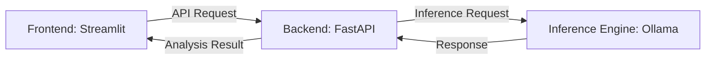
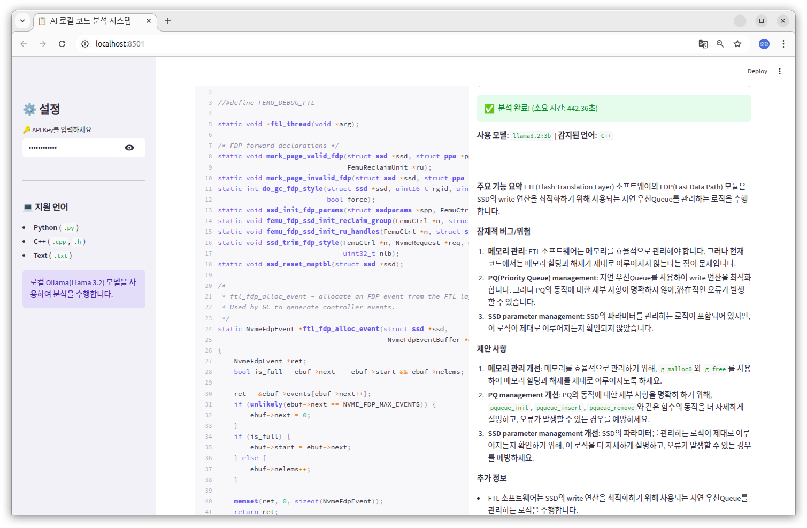

# 📋 AI 기반 로컬 멀티 언어 코드 분석 시스템 (데모 버전)

## 1. 프로젝트 개요
- **프로젝트명:** AI 기반 로컬 멀티 언어 코드 분석 시스템 (데모 버전)
- **목적:** 사용자가 업로드한 소스 코드(Python, C++ 등)를 로컬 LLM이 분석하여 요약, 버그 위험, 개선점을 제안하는 웹 애플리케이션 구축
- **핵심 가치:** 
  - 저사양 환경(CPU Only) 최적화
  - 다국어 소스 코드 지원
  - 모델 교체의 유연성

## 2. 시스템 아키텍처



- **Frontend (Streamlit):** 사용자 UI, 파일 업로드(Python/C++), 분석 결과 시각화
- **Backend (FastAPI):** 비즈니스 로직 처리, 프론트엔드와 모델 서버 간의 API 중계
- **Inference Engine (Ollama):** 로컬 모델 서빙 및 CPU 가속 추론 엔진

### 2.1 프로젝트 폴더 구조
```text
my-project/
├── 📁 app/
│   ├── auth.py              ← API Key 인증 (X-API-Key)
│   ├── schemas.py           ← Pydantic 입력/출력 데이터 모델
│   ├── model_service.py     ← Ollama 연동 및 분석 로직
│   └── main.py              ← FastAPI 서버 및 엔드포인트
├── 📁 frontend/
│   └── app.py               ← Streamlit UI
└── requirements.txt         ← 환경 의존성 (fastapi, streamlit, requests 등)
```

## 3. 사용자 요구사항 (User Requirements)
1. **멀티 언어 파일 업로드:** 사용자는 `.py` (Python) 및 `.cpp` (C++) 소스 코드 파일을 업로드할 수 있어야 한다.
2. **코드 미리보기:** 분석 실행 전 업로드된 코드의 구문 하이라이팅을 포함한 내용을 화면에서 확인할 수 있어야 한다.
3. **분석 실행 및 상태 표시:** 버튼 클릭 시 AI 분석이 시작되며, CPU 추론 시간을 고려한 진행 상태(Loading Spinner)를 표시해야 한다.
4. **분석 결과 제공:** AI가 분석한 세 가지 항목을 제공한다.
   - 주요 기능 요약
   - 잠재적 버그/위험
   - C++/Python 특성에 맞는 개선 제안
5. **추론 속도 모니터링:** 분석 완료 시 실제 소요된 **추론 수행 시간(Inference Time)**을 초(seconds) 단위로 화면에 표시한다.

## 4. 기술적 요구사항 (Technical Requirements)

### 4.1 하드웨어 및 실행 환경
| 항목 | 사양 | 비고 |
| :--- | :--- | :--- |
| **CPU** | Intel/AMD 프로세서 기반 | GPU 가속 없음, CPU 전용 모드 |
| **RAM** | 16GB 이상 | Llama 3.2 3B 기준 약 2.5GB 점유 |
| **OS** | Windows / macOS / Linux | Ollama 가동 가능 환경 |

### 4.2 소프트웨어 스택
- **Language:** Python 3.9+
- **Frontend:** Streamlit (st.chat_message, st.chat_input 기반 UI)
- **Backend:** FastAPI (Pydantic 데이터 검증 포함)
- **Model Server:** Ollama (Local API Service)
- **Security:** API Key 기반 서버 측 인증 (Header: X-API-Key)
- **Concurrency:** `asyncio` 및 `ThreadPoolExecutor`를 통한 비동기 추론 처리

### 4.3 모델 및 추론 설정 (Model Configuration)
> **기본 모델:** `Llama 3.2 (3B)`
- **교체 유연성:** 모델명 변수화를 통해 `DeepSeek-Coder` 등 타 모델로 즉시 교체 가능한 구조 설계
- **추론 파라미터:**

| Parameter | Value | Description |
| :--- | :--- | :--- |
| `stream` | `false` | 데모용 결과 일시 출력 |
| `num_predict` | `2048` | 응답 토큰 제한을 통한 속도 확보 |
| `temperature` | `0.2` | 코드 분석의 일관성 및 정확도 확보 |

## 5. 상세 기능 정의

### 5.1 백엔드 API (`/analyze`)
- **Endpoint:** `POST /analyze`
- **Input:** `file: UploadFile` (Multipart form-data)
- **Logic:**
  1. 파일 확장자 추출 및 텍스트 디코딩
  2. 언어(Python/C++)에 따른 맞춤형 분석 프롬프트 생성
  3. Ollama API를 통한 비동기 추론 요청
- **Output:** 파일명, 언어 타입, 사용 모델, 분석 결과 텍스트 (Success/Error 분기)
- **HTTP Status Codes:**
  - `200 OK`: 분석 성공
  - `401 Unauthorized`: API Key 누락 또는 불일치
  - `422 Unprocessable Entity`: 잘못된 파일 형식 또는 업로드 오류
  - `500 Internal Server Error`: 추론 엔진 오동작 또는 서버 내부 에러

### 5.2 프론트엔드 UI
- **업로드 위젯:** `.py`, `.cpp`, `.h`, `.txt` 확장자 필터링 지원
- **언어별 하이라이팅:** 확장자에 따라 `st.code(language='...')` 자동 설정
- **결과 영역:** 분석 모델명과 결과 리포트를 마크다운 형식으로 출력

## 6. 제약 및 고려 사항
- ⚠️ **CPU 가동률:** 분석 중 CPU 점유율이 일시적으로 100%에 도달할 수 있음을 사용자에게 고지
- 🛠️ **전문성 강화:** C++의 경우 메모리 누수(Memory Leak) 및 포인터 관련 위험 요소를 분석 프롬프트에 강조
- 📈 **확장성:** 추론 속도가 중요할 경우 더 경량화된 `DeepSeek-Coder-1.3B` 모델로 전환 시나리오 구비

---

## 7. 구현 과정 (Implementation Process)
1. **모델 선정:** 로컬 CPU 환경에서 가동 가능한 `Llama 3.2 3B` 모델을 선정하고 Ollama를 통해 서빙 환경 구축.
2. **백엔드 개발:** FastAPI를 이용해 파일 업로드 및 Ollama API 중계 엔드포인트 구현. `ThreadPoolExecutor`를 적용하여 CPU 추론 중에도 서버가 응답성을 유지하도록 비동기 처리.
3. **프론트엔드 개발:** Streamlit을 활용하여 드래그 앤 드롭 방식의 파일 업로드와 실시간 코드 하이라이팅 기능 구현.

## 8. 최종 체크포인트 (Day 8 Checkpoint)
- **Q1. 본인의 프로젝트에서 Pydantic 검증은 어떤 잘못된 입력을 막아줍니까?**
    - 잘못된 데이터 타입, 필수 필드 누락 등을 API 레벨에서 사전에 차단하여 서버 안정성 확보.

- **Q2. Depends(verify_api_key)를 제거하면 어떤 위험이 있습니까?**
    - 누구나 무단으로 서버 자원(CPU)을 소모하여 추론을 실행할 수 있음. 

- **Q3. run_in_executor를 사용한 이유는 무엇입니까?**
    - 모델 추론은 비동기 I/O가 아닌 CPU 바운드 작업이므로, 별도 스레드에서 실행해야 FastAPI의 이벤트 루프가 차단되지 않음.

- **Q4. Day 1~8 중 가장 많이 참고한 Day는 어디였습니까? 왜?**
    - Day 6(인증 및 파일 업로드)와 Day 5(API 구조 설계). 실제 서비스 형태를 갖추는 데 토대가 됨.

- **Q5. 이 서비스를 실제로 배포하려면 추가로 무엇이 필요합니까?**
    - Docker를 이용한 컨테이너화, HTTPS 보안 적용, 그리고 트래픽 증가에 대비한 로드 밸런싱 및 모델 서빙 최적화.

## 9. 회고 (Retrospection)
- **주요 성과:** 전체 아키텍처를 설계하고 실제 동작하는 AI 분석 서비스를 완성함.
- **벤치마크 테스트 결과:**
  - `2500 line`: C++ 파일을 GPU 없는 환경에서 코드 분석 수행 (440 초 소요)
- **배운 점:** Ollama API와 FastAPI 간의 비동기 통신 패턴 및 Streamlit을 활용한 신속한 서비스 배포 과정을 실습.
- **향후 과제:** 대규모 코드 처리를 위한 청크 분할(Chunking) 기법 도입 및 CPU 멀티코어 활용 최적화.

## 10. 스크린샷 (ScreenShot)

