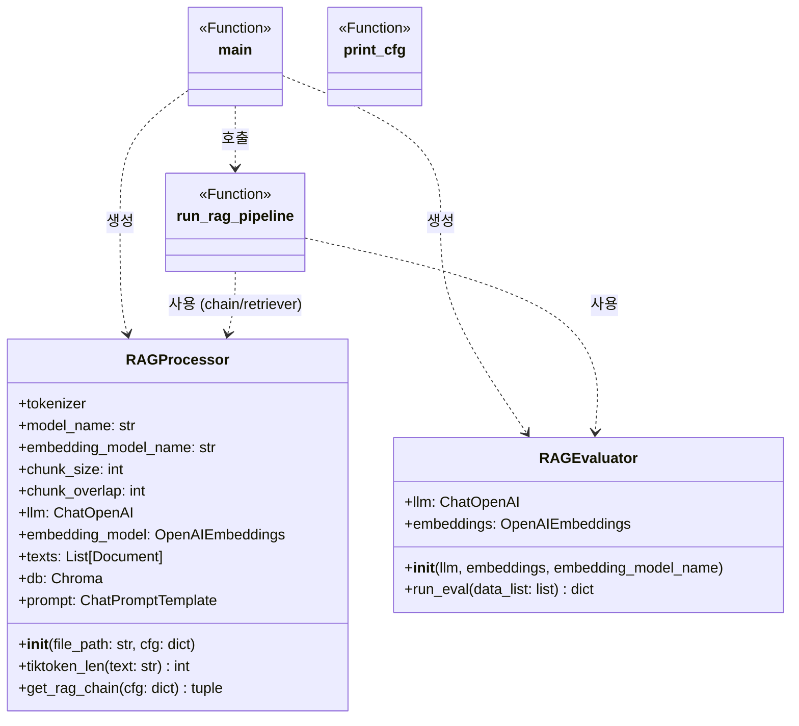

#### RAG 시스템 개선

* 개요 : 
    * RAG(Retrieval-Augmented Generation) 시스템의 성능을 개선한다. 
    * 성능 지표를 측정한다.

* 데이터
    * RAG 시스템 평가를 위한 고난도 데이터셋 (위키백과 '강아지' 기반)
        * 위피키디아 강아지 (https://ko.wikipedia.org/wiki/%EA%B0%95%EC%95%84%EC%A7%80)

* 실험 방법
    * 기존 프로젝트 코드 리팩토링후 config 값 변경하며 결과 확인

    * 
* 평가 항목 
    * 정량 평가 점수
        * Faithfulness (충실도) 
            * 생성된 답변이 검색된 (Context)에 얼마나 기반하고 있는지
            * '할루시네이션(환각)'이 얼마나 적은가

        * Answer Relevancy (답변 관련성)
            * 답변이 사용자의 질문 의도에 얼마나 부합하는가
            * 답변에 불필요한 내용이 너무 많거나, 질문의 핵심을 비껴나갔을 때 점수가 낮아집니다.

        * Answer Similarity (답변 관련성)
            * 답변이 사용자의 질문 의도에 얼마나 직접적으로 부합하는지 측정.

        * Context Recall (컨텍스트 재현율)
            * 질문에 답하기 위해 필요한 정보가 검색된 문서 안에 모두 포함되어 있는가

        * Context Precision (컨텍스트 정밀도)
            * 검색된 결과들 중에서 실제 정답과 관련된 유용한 정보가 상위권에 잘 배치되어 있는가
            * 검색 엔진이 가져온 문서들 중에 '노이즈(불필요한 정보)'가 섞여 있거나, 정말 중요한 문서가 뒤로 밀려나 있을 때 점수가 깎입니다.
        
        * Hit Rate (적중률)
            * 검색된 N개의 문서 중 정답 문서가 단 하나라도 포함될 확률
        
        * MRR (Mean Reciprocal Rank)
            * 첫 번째 정답 문서가 몇 번째 순위에 나오는지 역수로 계산한 평균값
            * 1/4이면 평균 4번째 순위에 정답 문서가 나오고 있습니다.3. 종합 평가
                
    * 정성 평가 점수 Qualitative Score
        * LLM이 정해진 척도(예: 1~5점)로 답변의 품질을 종합 점수화

## 결과 (Experimental Comparison)

| 실험 ID | LLM / Embedding | Chunk Size / Overlap | k | Multi Query | Search Type |
| :--- | :--- | :---: | :---: | :---: | :---: |
| **실험 1** | gpt-4o-mini / text-3-small | 1000 / 100 | 3 | False | similarity |
| **실험 2** | gpt-4o-mini / text-3-small | 1000 / 100 | **6** | False | similarity |
| **실험 3** | gpt-4o-mini / text-3-small | 1000 / 100 | **10** | False | similarity |
| **실험 4** | gpt-4o-mini / text-3-small | **1500** / 100 | 10 | False | similarity |

| 실험 구분 | Faithfulness | Answer Rel. | Context Recall | Context Precision | Answer Sim. | Hit Rate | MRR | Qual. Score |
| :--- | :---: | :---: | :---: | :---: | :---: | :---: | :---: | :---: |
| **실험 1** | 0.5327 | 0.3449 | 0.2500 | 0.3750 | 0.5754 | 0.6000 | 0.4000 | 3.5 |
| **실험 2** | 0.5357 | 0.3786 | **0.3500** | 0.3643 | 0.5935 | 0.6000 | 0.3867 | **3.7** |
| **실험 3** | **0.5545** | 0.3450 | 0.3500 | **0.4333** | 0.5735 | 0.6000 | **0.4500** | 3.7 |
| **실험 4** | 0.4860 | 0.3566 | 0.3500 | 0.3735 | **0.5893** | 0.6000 | **0.4583** | 3.6 |

2. 청크 크기(chunk_size) 실험
설명: 문서를 자르는 단위인 chunk_size를 조정합니다.
방법: RAGProcessor 초기화 시 chunk_size를 500, 1000, 1500 등으로 변경하여 문맥의 충분함과 노이즈 사이의 균형을 찾습니다.

3. 청크 중첩(chunk_overlap) 조정
설명: 잘린 문서들 사이의 연결성을 위해 겹치는 구간을 조정합니다.
방법: 보통 chunk_size의 10~20% 내외로 설정하며, 이를 늘렸을 때 정보 손실이 줄어드는지 테스트합니다.

4. MMR의 lambda_mult 값 튜닝
설명: MMR 검색 시 유사도와 다양성 사이의 가중치를 조절합니다.
방법: search_kwargs에 lambda_mult를 0.1(다양성 극대화)부터 0.9(유사도 극대화)까지 변경해 봅니다.

5. LLM의 temperature 설정
설명: 답변 생성 시 LLM의 창의성/일관성을 조절합니다.
방법: 현재 0으로 설정된 temperature를 0.3, 0.7 등으로 높여보며 답변의 풍부함을 비교합니다. (RAG에서는 보통 0~0.2가 권장됩니다.)

6. 임베딩 모델 교체
설명: 텍스트를 벡터로 변환하는 모델의 성능을 비교합니다.
방법: text-embedding-3-small 대신 더 고성능인 text-embedding-3-large를 사용하여 검색 정확도를 비교합니다.

7. LLM 모델 교체
설명: 답변 생성 및 멀티 쿼리 생성 모델을 변경합니다.
방법: gpt-4o 대신 가성비 좋은 gpt-4o-mini를 사용하여 성능 저하 없이 비용을 줄일 수 있는지 확인합니다.

8. 프롬프트 템플릿(System Prompt) 수정
설명: LLM에게 주는 지시문을 최적화합니다.
방법: 현재 영문 프롬프트를 한글로 변경하거나, "답을 모를 경우 모른다고 답하세요" 같은 제약 조건을 추가하여 faithfulness 점수를 높여봅니다.

9. 검색 임계값(score_threshold) 설정
설명: 관련성이 낮은 문서를 아예 제외시킵니다.
방법: search_type="similarity_score_threshold"를 사용하고 score_threshold를 0.5~0.8 사이로 설정하여 관련 없는 문서가 노이즈가 되는 것을 방지합니다.

10. Multi-Query의 생성 질문 개수 조정
설명: MultiQueryRetriever가 생성하는 질문의 수를 조절합니다. (사용자 정의 프롬프트 필요)
방법: 기본적으로 생성되는 질문 수 외에, 프롬프트 수정을 통해 더 많거나 적은 질문을 생성하게 하여 검색 성능을 비교합니다.

11. Selft ???

12. 

## 클래스 다이어그램

