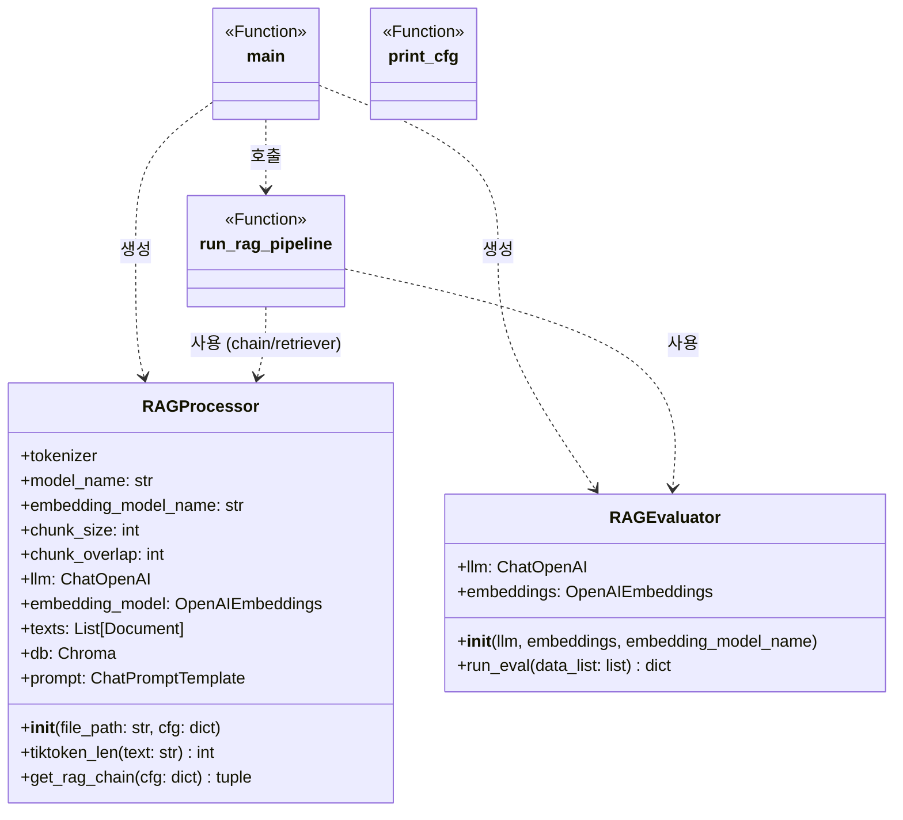

### 기존 프로젝트 (Naive RAG) 개선 과제

- 가이드 

    - 기존 프로젝트 (Naive RAG) vs 개선 적용
        - Parameter
        - new module
        - new pattern
        - 위 선택지에서 자유롭게 설정

    - 정량평가와 정성평가 적용 하기.

- 순서 
    - 기존 프로젝트 리팩토링 - 완료 
        - RetrievalQA 구조 -> LCEL 구조

    - 정량 평가 방법, 정성 평가 방법 적용
        - 정량 평가 - 

    - 이거 저거 적용
        * 성능 개선: Multi-Query Retriever를 적용한 결과, Context Recall 값이 **0.33에서 1.00으로 비약적으로 향상(200% 개선)
        * 전체적인 답변의 충실도와 관련성도 모두 상승했습니다. 상세한 비교 수치와 분석 결과는 walkthrough.md에서 확인

* 데이터 : 위피키디아 강아지 (https://ko.wikipedia.org/wiki/%EA%B0%95%EC%95%84%EC%A7%80)

* RAG 시스템 : 

* 실험 방법 : 

* 추가 항목 : 정성 평가

    * g-eval, llm-as-a-judgdement

성능 최적화 항목 

1. 검색 결과 개수(k) 조정
설명: 리트리버가 가져오는 문서의 개수(k)를 변경합니다.
방법: cfg = {"k": 3}에서 k를 1, 5, 10 등으로 바꿔보며 context_recall과 faithfulness의 변화를 확인합니다.

2. 청크 크기(chunk_size) 실험
설명: 문서를 자르는 단위인 chunk_size를 조정합니다.
방법: RAGProcessor 초기화 시 chunk_size를 500, 1000, 1500 등으로 변경하여 문맥의 충분함과 노이즈 사이의 균형을 찾습니다.

3. 청크 중첩(chunk_overlap) 조정
설명: 잘린 문서들 사이의 연결성을 위해 겹치는 구간을 조정합니다.
방법: 보통 chunk_size의 10~20% 내외로 설정하며, 이를 늘렸을 때 정보 손실이 줄어드는지 테스트합니다.

4. MMR의 lambda_mult 값 튜닝
설명: MMR 검색 시 유사도와 다양성 사이의 가중치를 조절합니다.
방법: search_kwargs에 lambda_mult를 0.1(다양성 극대화)부터 0.9(유사도 극대화)까지 변경해 봅니다.

5. LLM의 temperature 설정
설명: 답변 생성 시 LLM의 창의성/일관성을 조절합니다.
방법: 현재 0으로 설정된 temperature를 0.3, 0.7 등으로 높여보며 답변의 풍부함을 비교합니다. (RAG에서는 보통 0~0.2가 권장됩니다.)

6. 임베딩 모델 교체
설명: 텍스트를 벡터로 변환하는 모델의 성능을 비교합니다.
방법: text-embedding-3-small 대신 더 고성능인 text-embedding-3-large를 사용하여 검색 정확도를 비교합니다.

7. LLM 모델 교체
설명: 답변 생성 및 멀티 쿼리 생성 모델을 변경합니다.
방법: gpt-4o 대신 가성비 좋은 gpt-4o-mini를 사용하여 성능 저하 없이 비용을 줄일 수 있는지 확인합니다.

8. 프롬프트 템플릿(System Prompt) 수정
설명: LLM에게 주는 지시문을 최적화합니다.
방법: 현재 영문 프롬프트를 한글로 변경하거나, "답을 모를 경우 모른다고 답하세요" 같은 제약 조건을 추가하여 faithfulness 점수를 높여봅니다.

9. 검색 임계값(score_threshold) 설정
설명: 관련성이 낮은 문서를 아예 제외시킵니다.
방법: search_type="similarity_score_threshold"를 사용하고 score_threshold를 0.5~0.8 사이로 설정하여 관련 없는 문서가 노이즈가 되는 것을 방지합니다.

10. Multi-Query의 생성 질문 개수 조정
설명: MultiQueryRetriever가 생성하는 질문의 수를 조절합니다. (사용자 정의 프롬프트 필요)
방법: 기본적으로 생성되는 질문 수 외에, 프롬프트 수정을 통해 더 많거나 적은 질문을 생성하게 하여 검색 성능을 비교합니다.

11. Selft ???

12. 

## 클래스 다이어그램

