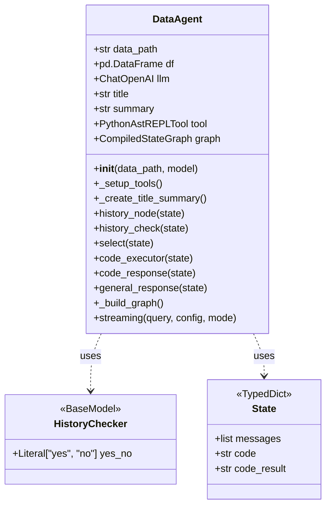
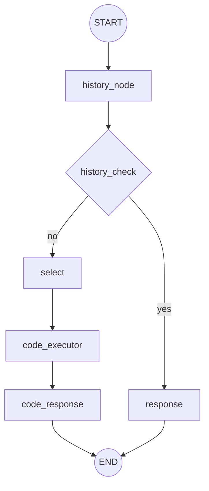

# Class Diagram for `ex01.py`

This diagram illustrates the structure and relationships of the classes defined in `ex01.py`.

## LangGraph Workflow Visualization

The following diagram illustrates the workflow of the LangGraph constructed in `_build_graph()`.

## LangChain vs LangGraph
* 차이 ? Hierarchy
* LangGraph
    * LLM + 상태가 있는(Stateful) 다중 에이전트 애플리케이션 용 라이브러리
    * LangChain 생태계의 일부, LangChain의 한계 극복
    * Graph = Nodes + Edge + State
    
    * LangChain - 레시피, 프레임워크
    * LangGraph는 - 라이브러리, (순환 구조(Cycles) + 상태)

## Basic
* State Graph
    * 상태 기반 워크플로우 구축 
    * node, edge, state

* Streaming 
    * 실행 중인 그래프 모니터링, LLM의 응답을 토큰 단위로 받아보고 싶은 경우
    * 사용자 경험 향상을 위해 실시간 표시
    
    * 그래프 실행 과정에서 발생하는 다양한 이벤트와 데이터를 실시간으로 스트리밍
    * 원하는 정보만 선택적으로 받을 수 있다.

    * mode 
        * 그래프 전체 상태가 필요하면 - values
        * 상태 변경 사항만 필요하면 updates 사용
        * LLM 응답을 실시간으로 표시하려면 messages 사용
        * 진행 상황이나 로그를 전송하려면 custom 사용
        * 디버깅이 필요하면 debug 사용
