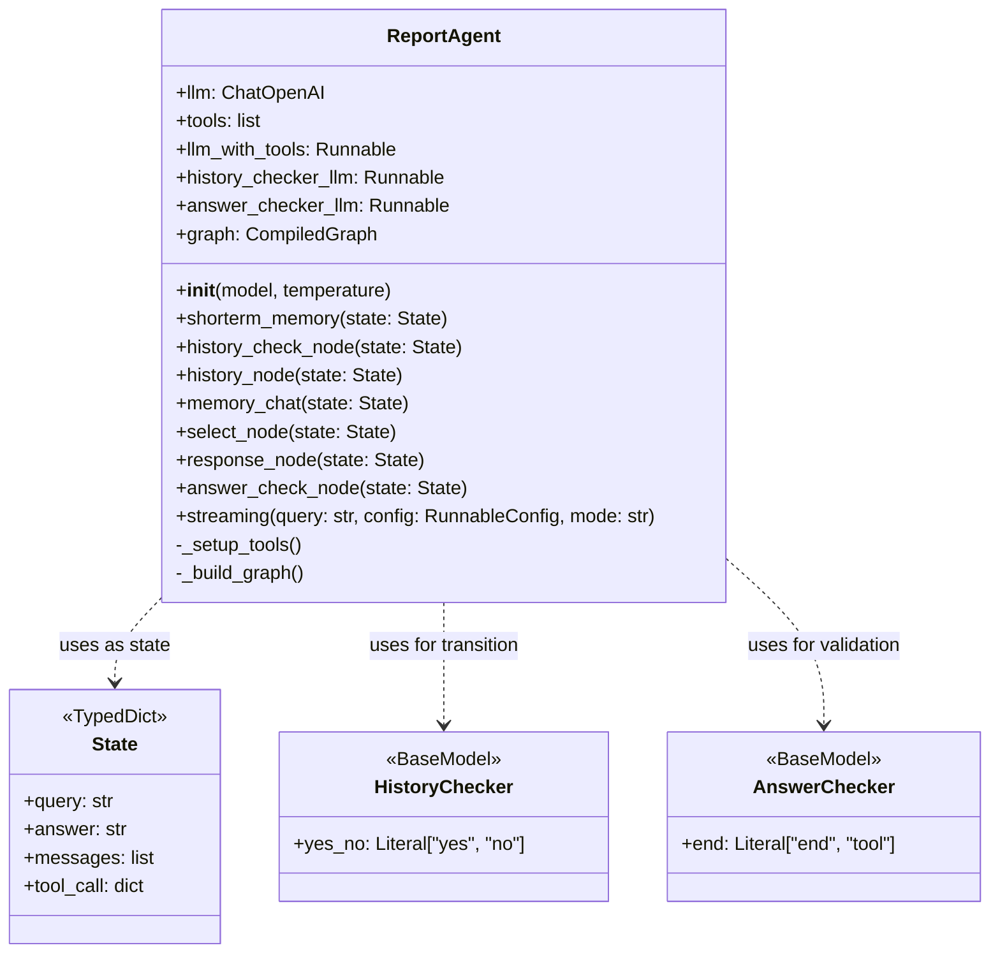
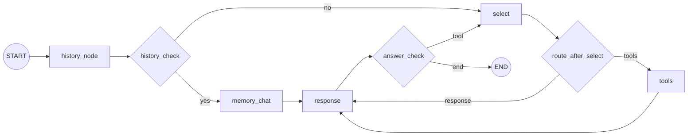
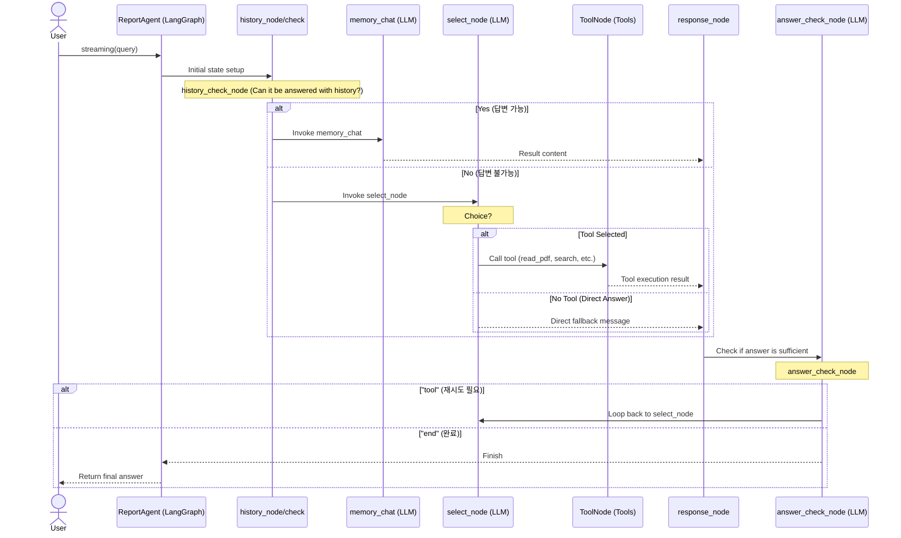

# ex2.py Class Diagram

`ex2.py` 파일의 주요 클래스 구조를 나타내는 클래스 다이어그램입니다.

## LangGraph Flowchart

`ex2.py`의 `_build_graph` 메서드로 구축된 에이전트 워크플로우를 나타내는 플로우차트입니다.

## Sequence Diagram

`ex2.py`에 구현된 `ReportAgent`의 구성 요소 간 상호작용을 나타내는 시퀀스 다이어그램입니다.

* history_node: 초기 상태를 설정하고 대화 시작 여부를 확인합니다.
* history_check_node: 이전 대화 기록만으로 답변이 가능한지 LLM이 판단합니다.
* memory_chat: 이전 대화를 바탕으로 답변을 구성합니다.
* select_node: 질문 해결을 위해 필요한 도구를 선택합니다.
* ToolNode: 선택된 도구(PDF 읽기/쓰기, 웹 검색, 코드 실행 등)를 실제로 실행합니다.
* response_node: LLM의 응답이나 도구 실행 결과에서 최종 답변 텍스트를 추출합니다.
* answer_check_node: 답변이 사용자의 질문을 충분히 해결했는지 검증하며, 필요시 도구 선택 단계로 되돌립니다.

## ToDo
* 그래프 구조와 동작을 코드와 함께 이해

## Done
*  

## Problem
* 그래프와 _build_graph() 매칭이 어렵다. 

## 요약 
* CompiledGraph 
    * 정의 (StateGraph) -> .compile() -> (실행 가능한)CompiledGraph 객체
    * 